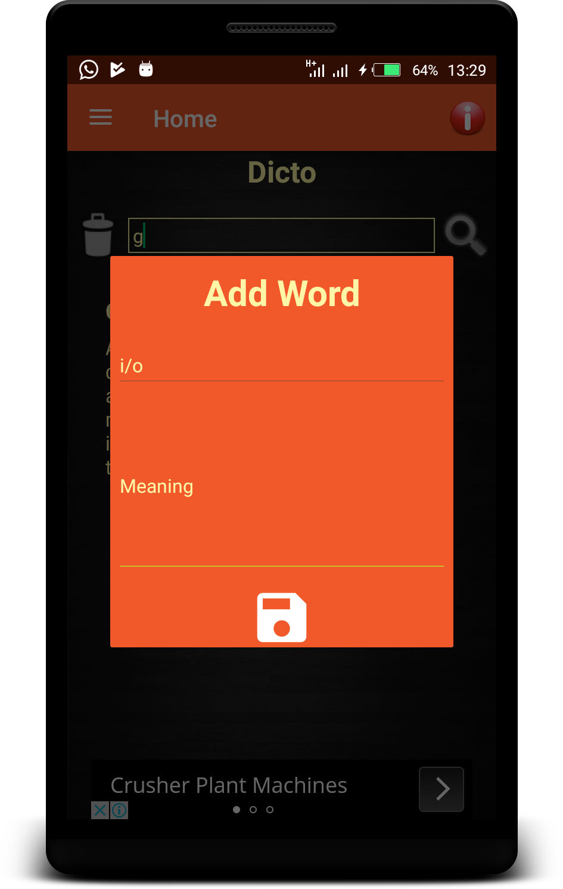
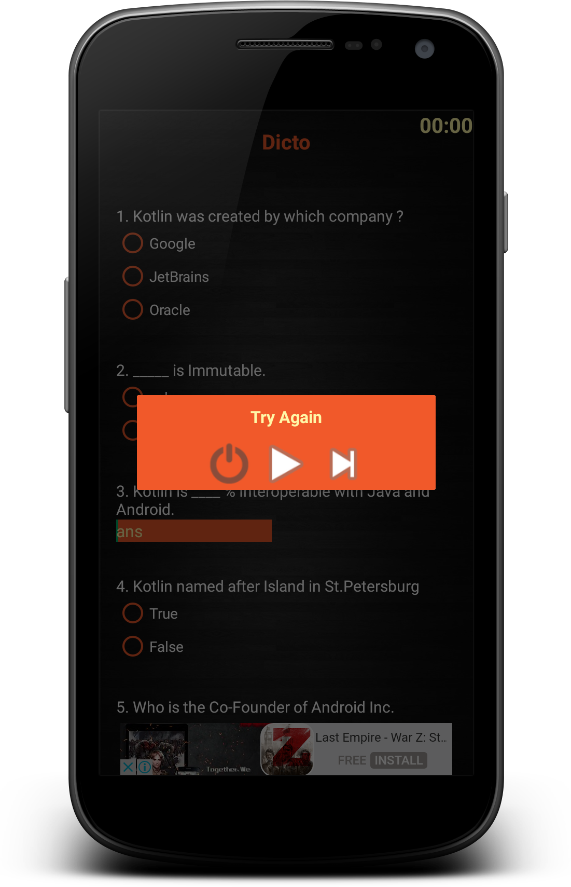

# Dicto v.1.0.0

A must have app for all android Developers.

Dicto is an App built for Android developers to improve their programming skills.It's very easy to use.


## ***PREVIEW***

| Home | Glossary |
|     ------------- | ------------- |
| | |


Requirements
==============
  - Android Studio 4.0 and above
  - kotlin_version = 1.4.32
  -  BuildToolsVersion : 30.0.3
  -  CompileSdkVersion : 30
  -  MinSdkVersion : 16
  - TargetSdkVersion : 30
  -  Gradle Version : 4.1.3


   DEPENDENCIES USED.
  =================

```
    implementation 'androidx.appcompat:appcompat:1.2.0'
    implementation 'com.google.android.material:material:1.3.0'
    implementation 'androidx.cardview:cardview:1.0.0'
    implementation 'de.hdodenhof:circleimageview:2.2.0'
    implementation 'androidx.constraintlayout:constraintlayout:2.0.4'
    implementation 'org.jetbrains.kotlin:kotlin-stdlib:$kotlin_version'
    implementation 'com.google.android.gms:play-services-ads:20.0.0'
    implementation 'org.jetbrains.anko:anko-sdk15:$ankoVersion'
    implementation 'org.jetbrains.anko:anko-appcompat-v7:$ankoVersion'
    implementation 'com.airbnb.android:lottie:3.4.1'
    implementation 'junit:junit:4.13.2'
    implementation 'androidx.multidex:multidex:2.0.1'


ext {
        // SDK and tools
        buildToolsVersion = '30.0.3'
        compileSdkVersion = 30
        minSdkVersion = 16
        targetSdkVersion = 30
        ankoVersion = '0.10.4'
    }

```