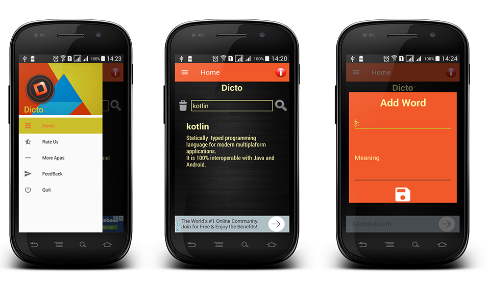

# Dicto v.1.0.0

A must have app for all android Developers.

Dicto is an offline dictinary for developers interested in learning both kotlin and Java.It's very easy to use.
No internet connection needed.

## Minimum Requirements

* Android Studio 3.0 Canary Channel
* Kotlin compiler and runtime version -1.1.2-4
* buildToolsVersion- 26.0.0
* compileSdkVersion - 26 
* targetsSdkVersion - 26
* ankoVersion  - 0.9.1a
* supportLibraryVersion -26.0.0-alpha1

# Help
For help,email tanamoinc@gmail.com.

# License
    Copyright 2017 Tanamo Inc.
    Licensed under the Apache License, Version 2.0 (the "License");
    you may not use this file except in compliance with the License.
    You may obtain a copy of the License at

       http://www.apache.org/licenses/LICENSE-2.0

    Unless required by applicable law or agreed to in writing, software
    distributed under the License is distributed on an "AS IS" BASIS,
    WITHOUT WARRANTIES OR CONDITIONS OF ANY KIND, either express or implied.
    See the License for the specific language governing permissions and
    limitations under the License.

## Suggestions are welcome.